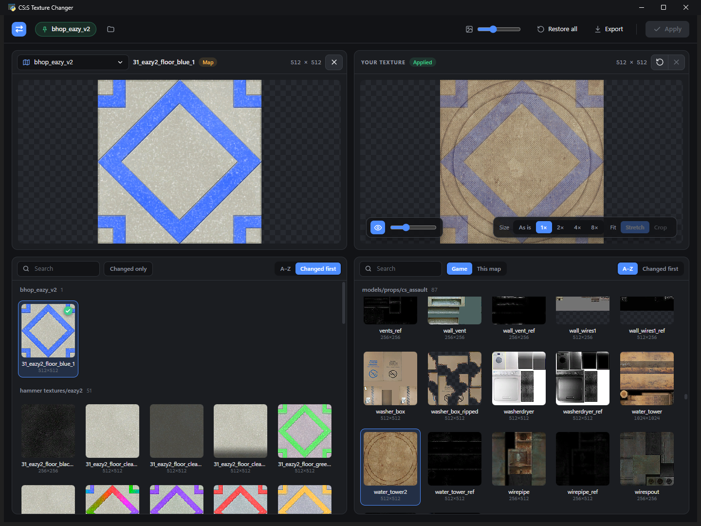

# texturechanger

**Swap any texture in Counter-Strike: Source on your own PC, including the custom textures packed inside maps, without editing a single map file.**

> [!IMPORTANT]
> **Textures packed inside a map only change on one map at a time, and that map has to be the first map you load or join after starting CS:S.**
> The map you last applied changes on becomes the *active map*. If you join a different map first (or the server changes map), its packed textures go back to normal until you restart the game.
> Base game textures aren't affected by this: changes to those work on every map. [Why?](#how-it-works)



Pick a map, click the texture you want to change, then click what to replace it with: any base game texture, any texture from the map, or your own image. Hit **Apply**, restart CS:S, done.

## Features

- **Every texture at a glance.** All textures of a map (or the whole game) in one scrollable thumbnail grid, grouped by folder, with search and *Changed first* sorting.
- **Replace with anything.** Base game textures, the map's own textures, or your own PNG / JPG / TGA / BMP / `.vtf`. Drag tiles or files straight onto the preview.
- **Works on map-packed textures.** Custom bhop / surf / kz maps pack their textures inside the `.bsp`. texturechanger still replaces them, without touching the map file (see [How it works](#how-it-works)).
- **Size control.** Make your texture show 1×, 2×, 4× or 8× bigger on walls (fewer repeats), stretch or crop it to fit, and lay the original over it to compare sizes.
- **Profiles per map.** Changes made on a map are saved to that map. Changes made under *All game textures* apply everywhere.
- **Nothing is permanent.** Restore one texture or everything with one click. Your original images are kept, so you can re-size later at full quality.

## Install

### Windows

1. Download `texturechanger.exe` from the [latest release](https://github.com/teleqwe/texturechanger/releases/latest), or [build it yourself](#build-from-source).
2. Run it. It finds Counter-Strike: Source through Steam automatically (or asks you where it is).

Requires Windows 10/11 with the Microsoft Edge WebView2 runtime (already installed on Windows 11).

### Linux (experimental)

Linux support is new and not yet tested on a real Linux install, so please [open an issue](https://github.com/teleqwe/texturechanger/issues) if something doesn't work. It's for the native Linux version of CS:S; Steam is found in `~/.steam/steam`, `~/.local/share/Steam` or the Flatpak folder.

```
git clone https://github.com/teleqwe/texturechanger && cd texturechanger
python3 -m venv .venv && . .venv/bin/activate
pip install -r requirements.txt "pywebview[qt]"
python3 texturechanger.py
```

`pywebview[qt]` gives the window a Qt web view. If you'd rather use GTK, install your distro's WebKitGTK Python bindings instead (for example `python3-gi gir1.2-webkit2-4.1` on Debian/Ubuntu) and create the venv with `--system-site-packages`. To get a single binary, run `pip install pyinstaller` and `sh build.sh` (output: `dist/texturechanger`). Settings are kept in `~/.config/texturechanger/`.

## How to use

1. **Pick a map** with the dropdown in the top-left corner, or keep *All game textures*.
2. **Click the texture to change** in the bottom-left grid.
3. **Click what to replace it with** in the bottom-right grid (*Game* textures, *This map*'s textures, or *Upload file*).
   You can also drop an image on **Your texture**, or double-click it to upload.
4. Adjust **Size** and **Fit** if you like. The eye button lays the original over yours to compare sizes.
5. Click **Apply**, then **restart CS:S**. The map you edited must be the **first map you load or join** after starting the game.

| Button | What it does |
| --- | --- |
| **X** on Your texture | Drops a change you haven't applied yet |
| **↺** on Your texture | Restores the original (deletes your applied replacement) |
| **X** on Original | Deselects the texture |
| **Restore all** | Puts every texture changed on this map (or all global changes) back |
| **Export** | Saves the original texture as a PNG |
| **Pin chip** (top left) | Shows the active map; click it to open that map |

## How it works

CS:S looks for every file in a list of places, top to bottom, and uses the first copy it finds. Your replacements go in a mod folder, `cstrike/custom/texturechanger/`, which sits near the top of that list, so they beat the game's own textures.

**Map-packed textures are the catch.** When a map loads, the engine mounts the map's `.bsp` (with its packed files) at the very top of the list, above every custom folder, so a map's own textures normally always win. texturechanger gets around this with one line in `cstrike/gameinfo.txt`, right below the custom folders:

```
game+mod    cstrike/custom/*
game        "|gameinfo_path|download/maps/bhop_example.bsp"   // texturechanger pin
```

That line mounts the map at startup, **below** the custom folders. When the map then loads, the engine sees it's already mounted and leaves it where it is, so your replacements win. The map file itself is never modified, so servers' map checks still pass.

That map is the **active map**. The app sets it automatically when you apply a change on a map. Only one map can be active at a time, and it has to be the first map you load after starting CS:S (loading a different map first undoes it until you restart). If a Steam update or file check restores `gameinfo.txt`, the app puts the line back the next time it starts. The original is backed up as `gameinfo.txt.texturechanger.bak`.

**Size** works because the engine sizes a texture on walls by its pixel size: a replacement twice as wide as the original covers twice the area per copy.

### Profiles

```
cstrike/custom/texturechanger/
├── materials/                 ← what the game reads: global + active map's changes
├── _profiles/
│   ├── _global/               ← changes made under "All game textures"
│   └── bhop_example/          ← changes made on that map
│       ├── materials/...vtf
│       └── _source/           ← the images you used, for re-sizing later
└── pinned_map.txt
```

Switching the active map rebuilds `materials/` from the profiles using hard links, so it's instant.

## Limitations

- **Servers with `sv_pure 1` or `2`** force the default textures. Most bhop / surf / kz servers run `sv_pure 0`.
- **One active map at a time** for map-packed textures, and it must be the first map you load.
- Cubemaps and animated textures can only be replaced with a ready-made `.vtf` (used as is).
- Textures on props placed in a map aren't listed yet; brush, skybox and packed textures are.

## Build from source

Requires Python 3.12+. On Windows:

```
pip install -r requirements.txt pyinstaller
python texturechanger.py                              # run from source
powershell -ExecutionPolicy Bypass -File build.ps1    # run tests, build texturechanger.exe, copy it to the Desktop
```

On Linux see [Linux](#linux-experimental); `build.sh` builds `dist/texturechanger`.

| File | Purpose |
| --- | --- |
| `texturechanger.py` | Reads the game (VPKs, maps, VTFs), converts images, manages profiles and the active map |
| `ui.html` | The interface (HTML/CSS/JS in a WebView2 window via pywebview) |
| `test_texturechanger.py` | Checks texture conversion, material parsing and the `gameinfo.txt` line |
| `build.ps1` / `build.sh` | Builds the single-file app with PyInstaller (Windows / Linux) |
| `icon.ico` | App icon |

Built with [srctools](https://github.com/TeamSpen210/srctools) (VPK / BSP / VTF), [Pillow](https://python-pillow.org/) and [pywebview](https://pywebview.flowrl.com/).

## License

[MIT](LICENSE). Not affiliated with Valve. texturechanger only changes files in your own game folder and never touches the game's executables or map files, but use it at your own risk.
